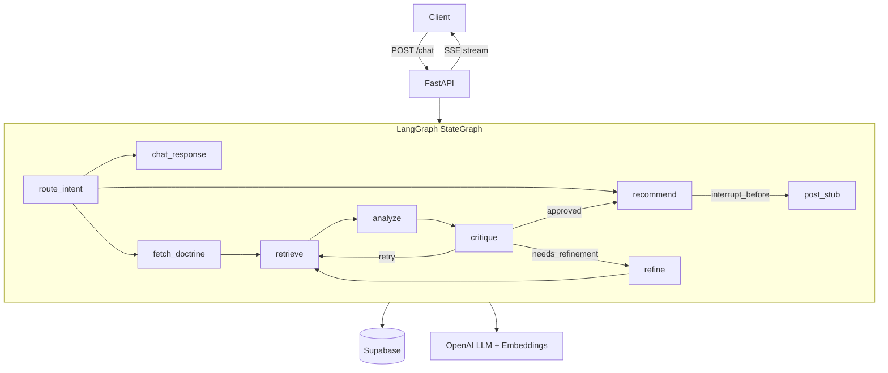

# video-agent

A multi-tenant video clip recommendation agent built with LangGraph, deployed on Render as a FastAPI service with SSE streaming.

Users (video creators) chat with the agent. It searches a Supabase database of transcript chunks and brand doctrine, drafts a clip recommendation, self-reviews against the client's brand rubric until quality is acceptable, then asks the user to approve before posting via OpusClip.

---

## Architecture



### Runtime context

`RuntimeContext` (defined in `orchestrator/runtime.py`) carries the Supabase client, tool implementations, LLM, and embedder. It is injected per-request via `config["configurable"]["runtime"]` and is **never stored in `AgentState`** — so the checkpointed state remains fully JSON-serialisable.

---

## Graph flow

```
START
  → route_intent
       ├── chitchat                  → chat_response → END
       ├── follow_up (reuse_context) → analyze ───────────────────┐  (reuses existing chunks + transcript)
       ├── follow_up (fresh)         → fetch_doctrine → retrieve   │  (re-retrieves with the new instruction)
       └── new_request               → fetch_doctrine → retrieve   │
                                             ↓                      │
                                           analyze ◄────────────────┘
                                             ↓
                                          critique
                                     ┌─ approved ──────────────→ recommend → [interrupt] → post_stub → END
                                     ├─ needs_refinement → refine → retrieve  (loop)
                                     └─ retry             → retrieve  (loop)
```

`route_intent` decides — in the same LLM call — whether a follow-up can reuse the
already-retrieved chunks/transcript (`reuse_context: true`, routes straight to `analyze`)
or needs a fresh search (`reuse_context: false`, routes through `retrieve`).

`analyze` returns a **ranked list of clip candidates** (`candidate_clips`, up to
`clip_candidate_count`); the top clip is mirrored into `candidate_recommendation` for
critique gating. `recommend` presents the whole ranked breakdown as a numbered list of
time frames, grounded in the actual B2 transcript (`source_file_content`).

The graph pauses (`interrupt_before=["post_stub"]`) after `recommend` so the creator can
confirm. Confirmation happens two ways:

- **`POST /confirm`** with `action="approved"|"rejected"` (button-based).
- **A natural-language `/chat` message** while awaiting confirmation. A lightweight
  classifier (`confirm_intent`) reads it as `approve` / `reject` / `other`. "approve"
  (e.g. *"turn this into an opus project"*) resumes `post_stub`; "reject"/"other" clears
  the gate without running `post_stub` and the message is handled as a fresh turn.

On approval, `post_stub` creates an **OpusClip project from the full source video**
(`full_file=True`) and lets Opus auto-curate clips across the whole file.

---

## Local setup

```bash
git clone <repo>
cd video-agent

# Python 3.12 (use pyenv or system)
python -m venv .venv
source .venv/bin/activate          # Windows: .venv\Scripts\activate

pip install -r requirements-dev.txt

cp .env.example .env
# Fill in .env with your keys

uvicorn orchestrator.main:app --reload
```

---

## Environment variables

| Variable | Required | Default | Description |
|---|---|---|---|
| `SUPABASE_URL` | ✓ | — | Supabase project URL |
| `SUPABASE_SERVICE_KEY` | ✓ | — | Service-role key (bypasses RLS) |
| `SUPABASE_DB_URL` | ✓ | — | Postgres connection string for checkpointer |
| `OPENAI_API_KEY` | ✓ | — | LLM + embeddings |
| `LLM_MODEL` | | `gpt-4o` | OpenAI chat model ID |
| `EMBEDDING_MODEL` | | `text-embedding-3-small` | OpenAI embedding model |
| `MAX_CRITIQUE_ITERATIONS` | | `3` | Max critique/refine loops before forced approval |
| `LANGCHAIN_TRACING_V2` | | `false` | Enable LangSmith tracing |
| `LANGCHAIN_API_KEY` | | — | LangSmith API key |
| `LOG_LEVEL` | | `INFO` | structlog level |

---

## API

### POST /chat

Start or continue a session.

**Headers:** `X-Client-ID: <uuid>`

**Body:**
```json
{ "session_id": "my-session-123", "message": "Find me a great hook clip about consistency" }
```

**SSE events:**
- `node` — emitted after each graph node completes
- `awaiting_confirmation` — graph paused before posting; includes `recommendation` markdown
- `done` — graph completed without posting (e.g., chitchat)

**curl:**
```bash
curl -N -X POST http://localhost:8000/chat \
  -H "Content-Type: application/json" \
  -H "X-Client-ID: 00000000-0000-0000-0000-000000000001" \
  -d '{"session_id":"sess-1","message":"Find me a hook clip about consistency"}'
```

---

### POST /confirm

Resume a paused session after user approval/rejection.

**Headers:** `X-Client-ID: <uuid>`

**Body:**
```json
{ "session_id": "my-session-123", "action": "approved" }
```

`action` is `"approved"` or `"rejected"`.

**curl:**
```bash
curl -N -X POST http://localhost:8000/confirm \
  -H "Content-Type: application/json" \
  -H "X-Client-ID: 00000000-0000-0000-0000-000000000001" \
  -d '{"session_id":"sess-1","action":"approved"}'
```

---

### GET /health

Returns `{"status": "ok", "version": "<git sha>"}`.

### GET /readyz

Verifies DB reachability. Used by Render health checks.

---

## Running tests

```bash
pytest tests/ -v
```

CI runs ruff + mypy + pytest on every push via `.github/workflows/ci.yml`.

---

## Deployment (Render)

The service is defined in `render.yaml`. It uses Docker, health-checks `/readyz`, and expects all env vars to be set in the Render dashboard.

> **Note:** Render's free tier sleeps after 15 minutes of inactivity. Cold starts break long-lived SSE connections. Use the **Starter plan** for any real workload.

---

## Troubleshooting

**`X-Client-ID header is required` (400)**
Include the header on every request: `-H "X-Client-ID: <uuid>"`.

**`Database not reachable` (503) on `/readyz`**
Check `SUPABASE_DB_URL`. The checkpointer needs a direct Postgres connection, not the Supabase REST URL.

**Graph never reaches `post_stub`**
The graph pauses with `interrupt_before=["post_stub"]`. You must call `POST /confirm` to resume.

**LangSmith traces not appearing**
Set `LANGCHAIN_TRACING_V2=true` and `LANGCHAIN_API_KEY`. LangChain reads these env vars natively.

**Forced approval note in recommendation**
The critique loop ran `MAX_CRITIQUE_ITERATIONS` times or retrieved the same top-5 segments twice. The system approved the best available match and appended an explanatory note.
